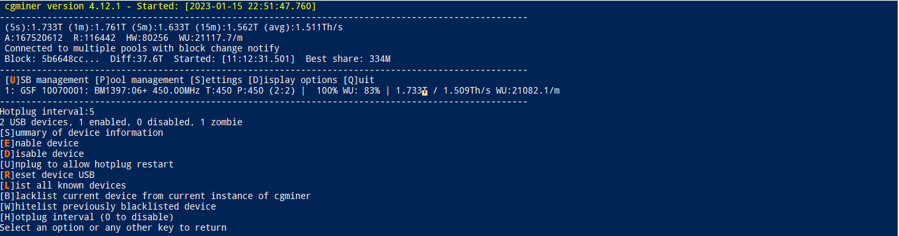
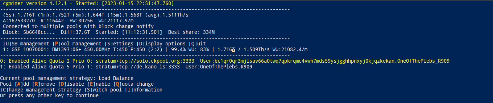
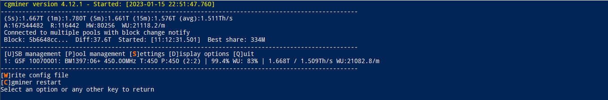
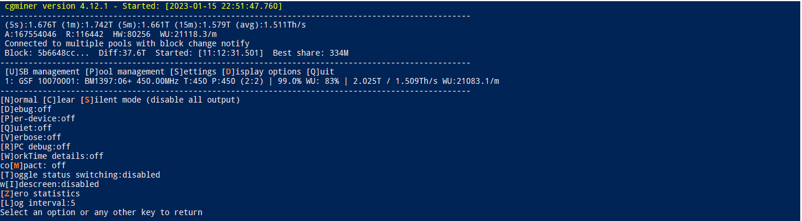

# Cgminer GUI

Die unten genannten Erklärungen beruhen auf Erfahrungswerten, Dokumentation und Dialogen mit Entwicklern und Anwendern des cgminers. Daher können Details lückenhaft und/oder fehlerhaft beschrieben sein. Wenn es Dinge gibt die richtig gestellt oder ergänzt werden sollen, bitte ich um genau diese Rückmeldung.

## GUI - Main menu

Das Hauptmenü zeigt folgende Daten (siehe das Äquivalent in den roten Kästchen im obigen Screenshot):

Äquivalent im Screenshot | Beschreibung
-------------------------|-------------
`(avg):1.511TH/s` | Die gemittelte Hashleistung seit Start der Mining-Software bzw. seit dem letzten Reset der Statistiken
`A:167502850` | Anzahl der akzeptiereten Shares (`a`ccepted)
`R:116442` | Anzahl der abgelehnten Shares (`r`ejected)
`HW:80256` | Anzahl der Hardware-Fehler
`1: GSF 10070001: BM1397:06+` | Miner auf Slot `1` mit der Seriennummer `10070001` mi6 `6` ASICS des Chipsatzes `BM1397`
`450.00MHz T:450 P:450` | ASIC-Frequenz und Target-Frequenz
`(2:2)` | Geschwindigkeit mit der Shares an die ASICs geleitet werden in ms
`100% WU: 83%` | Effizienzindikator `WU` ist die Anzahl der Work Units, also die shares pro minute (accepted vs rejected)

## GUI - Sub menues

Vom Haupmenü aus gelangt man durch Drücken der Taste für den jeweiligen Buchstaben in weitere Untermenüs zur erweiterten Anzeige von Daten bzw. zur weiteren Konfiguration.

Tastatur-Shortcut | Beschreibung
------------------|-------------
`U` | (`U`)SB management 
`P` | (`P`)ool management: Hier können Pools hinzugefügt oder gelöscht werden, sowie Quotas und Prioritäten verwaltet werden.
`S` | (`S`)ettings: Reset der Mining-Software und Schreiben einer Config-Datei
`D` | (`D`)isplay: Erweitern und Reduzieren der eingeblendeten Informationen.
`Q` | (`Q`)uit cgminer, close process

### (`U`)SB management

### (`P`)ool management

Sehr hilfreiches Menü zusammen mit dem (`S`)ettings-Menü um mehrere Pools anzulegen, Quotas und Prioritäten festzulegen und diese dann direkt in die Config-Datei zu schreiben. Die Quotas können beliebig gewählt werden, beispielhaft ist ein Quota von Pool1 zu Pool2 von `3:1` gleich zu `75:25` (wenn man es lieber in % ausdrücken möchte).

Die Priorität gibt an auf welchen Pool im Fehlerfall zuerst gemint werden soll.

### (`S`)ettings

(`W`)rite config file: Erstellen/Überschreiben der Konfigurationsdatei

(`C`)gminer restart: Reset der Mining-Software und Rücksetzen der Statistiken. Durch den Reset wird auch die Nummerierung der Miner rückgesetzt, dies muss bei manchen API-calls berücksichtigt werden.

### (`D`)isplay

(`Z`)ero statistics: Rücksetzen der Statistiken bietet sich an bei Neukonfiguration des Miners, so dass z.B. alle gemittelten Werte neu berechnet werden.

---

####  [⛏ Mining Software starten](start_mining.md)  ᐊ  previous | next  ᐅ  [Mining Software - Erweiterte Konfiguration](EnhancedConfiguration.md)
