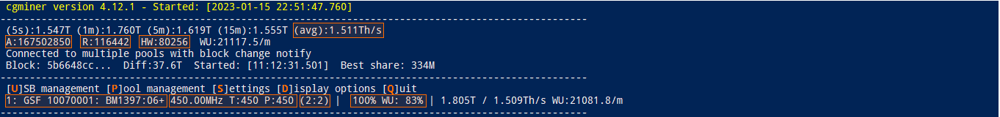

# Cgminer GUI

Die unten genannten Erklärungen beruhen auf Erfahrungswerten, Dokumentation und Dialogen mit Entwicklern und Anwendern des cgminers. Daher können Details lückenhaft und/oder fehlerhaft beschrieben sein. Wenn es Dinge gibt die richtig gestellt oder ergänzt werden sollen, bitte ich um genau diese Rückmeldung.

## GUI - Main menu

Das Hauptmenü zeigt folgende Daten (siehe das Äquivalent in den roten Kästchen im obigen Screenshot):

Äquivalent im Screenshot | Beschreibung
-------------------------|-------------
`(avg):1.511TH/s` | Die gemittelte Hashleistung seit Start der Mining-Software bzw. seit dem letzten Reset der Statistiken
`A:167502850` | Anzahl der akzeptiereten Shares (`a`ccepted)
`R:116442` | Anzahl der abgelehnten Shares (`r`ejected)
`HW:80256` | Anzahl der Hardware-Fehler
`1: GSF 10070001: BM1397:06+` | Miner auf Slot `1` mit der Seriennummer `10070001` mi6 `6` ASICS des Chipsatzes `BM1397`
`450.00MHz T:450 P:450` | ASIC-Frequenz und Target-Frequenz
`(2:2)` | Geschwindigkeit mit der Shares an die ASICs geleitet werden in ms
`100% WU: 83%` | Effizienzindikator `WU` ist die Anzahl der Work Units, also die shares pro minute (accepted vs rejected)

Vom Haupmenü aus gelangt man durch Drücken der Taste für den jeweiligen Buchstaben in weitere Untermenüs zur erweiterten Anzeige von Daten bzw. zur weiteren Konfiguration.

---

####  [⛏ Mining Software starten](start_mining.md)  ᐊ  previous | next  ᐅ  [Mining Software - Erweiterte Konfiguration](EnhancedConfiguration.md)
