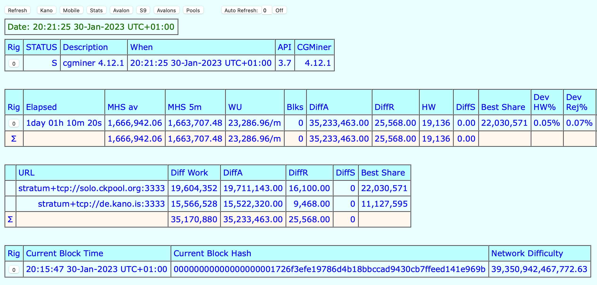
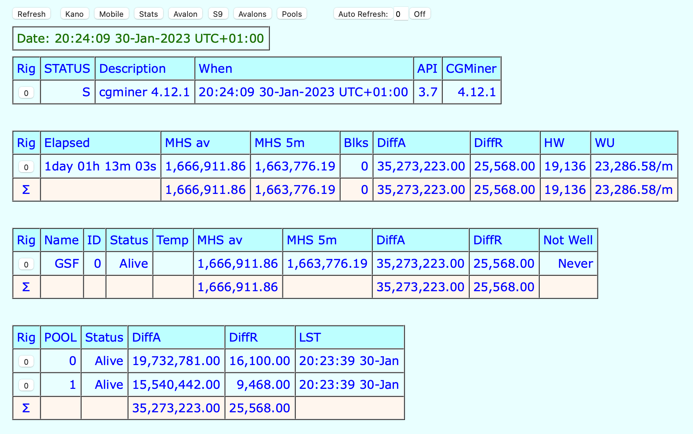
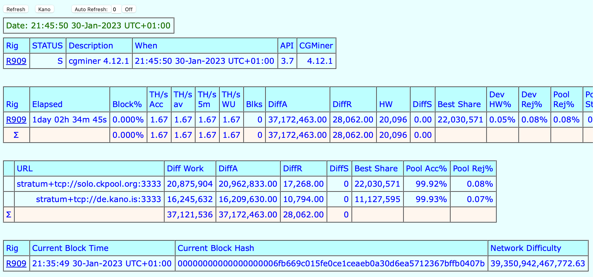
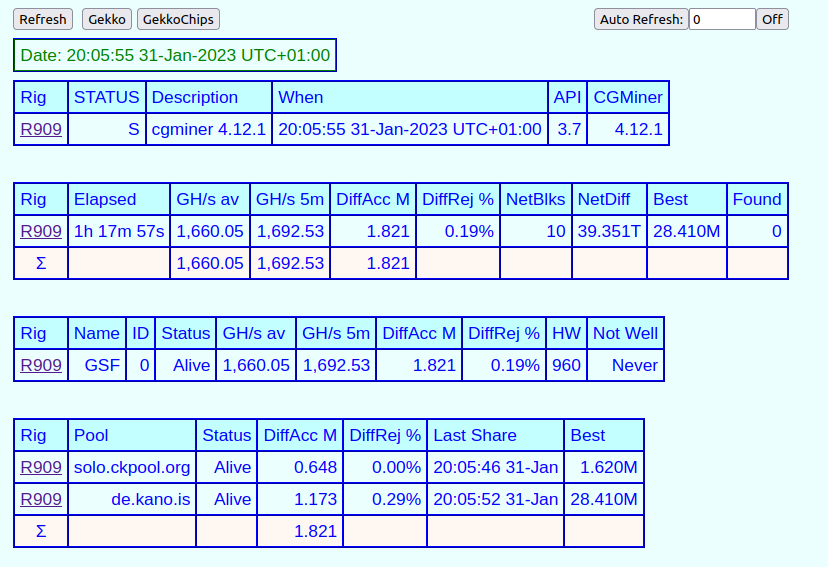
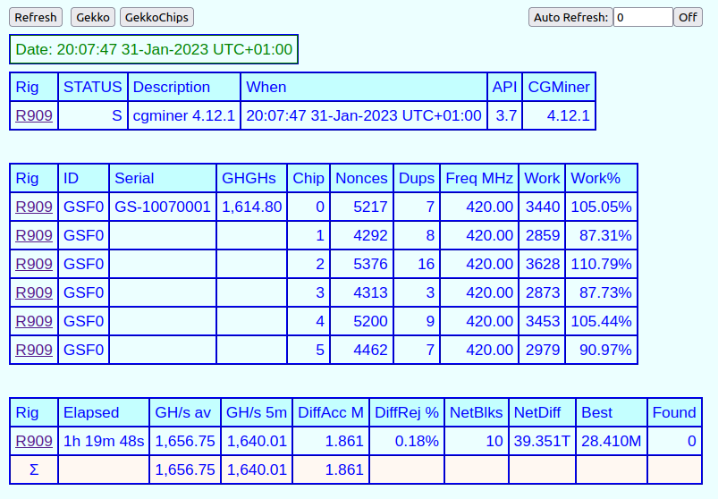
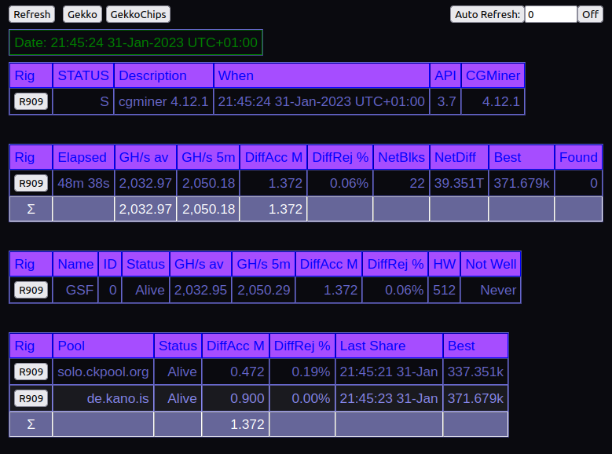

# Miner.php Datei

cgminer ab der Version 4.12.1 liefert eine PHP-Datei aus namens `miner.php` und ist im Verzeichnis der Miner-Software zu finden. Wenn man diese durch den u.U. bereits vorhandenen Apache-Webserver anzeigen lassen will, so hat man für das interne Netzwerk eine brauchbare Anzeige über den Browser.

Auf dem RaspiBlitz läuft bereits eine Version des Apache2, der man nur noch beibringen muss PHP-Dateien zu akzeptieren. Dazu gibt es mehrere Dutzend Anleitungen im Netz, in Kürze läuft das etwa so:

```console
sudo apt-get install -y libphp_XXX YYYY
```

Für die Darstellung der Datei `miner.php` im Browser muss man diese Datei zunächst in das Verzeichnis des Webservers kopieren (auf dem Raspi ist das `/var/www/html`) oder man legt einen sogenannten Softlink (oder symlink oder symbolic link) im Verzeichnis des Webservers an und veweist auf die genannte Datei nach diesem Schema `ln -s /path/to/file /path/to/symlink`:

```console
ln -s /home/admin/Mining/cgminer_4.12.1/miner.php /var/www/html/
```

Nun kann man überprüfen ob sich unter der Adresse des Webservers ein Datei `miner.php` befindet durch Aufrufen der Adresse `http://<HOSTNAME>/miner.php` im Browser, `<HOSTNAME>` muss eben durch die IP-Adresse Eures Raspis ersetzt werden. Das Ergebnis sieht dann so aus:



oder so (je nach Einstellung):



---

Wenn man nun die `miner.php` sorgfälltig durchliest, kann man erkennen das sich die Datei `miner.php` leicht durch eine externe Datei `myminer.php` anpassen lässt. Ich kann Euch nicht das durchlesen der Kommentare ersparen und auch nicht das Ausprobieren und Debuggen, **ABER** es lohnt sich hier ein paar Stunden zu verwenden.

Zuerst legen wir die Datei `myminer.php` im Arbeitsverzeichnis an (da wo auch die miner.php liegt), also in meinem Fall  im Verzeichnis `/home/admin/Mining/cgminer_4.12.1/`:

```console
sudo nano /home/admin/Mining/cgminer_4.12.1/myminer.php
```

mit dem Inhalt:

```php
<?php                                                                                                                                    
$rigs = array('127.0.0.1:4028:R909');                                                                                                    
$readonly = true;                                                                                                                       
$allowgen = true;                                                                                                                        
$rigbuttons = false;                                                                                                                     
$rigipsecurity = false;                                                                                                                  
$customsummarypages = array('Summary' => 1, 'Kano' => 1);                                                                             
?>
```

nun wieder ausführbar machen:

```console
sudo chmod 755 /home/admin/Mining/cgminer_4.12.1/myminer.php
```

und entweder in das Verzeichnis des Webservers kopieren (`/var/www/html/`) oder einen symlink darauf verweisen lassen nach bereits erwähntem Schema `ln -s /path/to/file /path/to/symlink`:

```console
ln -s /home/admin/Mining/cgminer_4.12.1/myminer.php /var/www/html/
```

und schon hat man eine theoretisch angepasste Seite nach eigenem Gusto:



> :memo: Die Felder und Tabellen können mit etwas Programmierkenntnissen auf eigene Bedürfnisse angepasst werden. Wenn ihr wisst wie es geht, sagt mir Bescheid ;-)

---

## Für die Gekko-Freunde (R909 und Compac F)

Zuerst müssen wir die neueste Version von `miner.php` über Github holen:

```console
cd /home/admin/Mining/cgminer_4.12.1/
git pull
```

Diese beinhaltet spezielle Anpassungen für die Gekko-Fraktion. Durch Anpassen der `mymoner.php` können wir nun auf diese Anpassungen zugreifen:

```php
<?php                                                                                                                                    
$rigs = array('127.0.0.1:4028:R909');                                                                                                    
$readonly = true;                                                                                                                       
$allowgen = true;                                                                                                                        
$rigbuttons = false;                                                                                                                     
$rigipsecurity = false;                                                                                                                  
$customsummarypages = array('Gekko' => 1, 'GekkoChips' => 1);                                                                             
?>
```

Das Ergebnis ist dann wie folgt:





---

## Fun Section

Für die Verspielten unter Euch: Wenn ihr folgendes in die Datei myminer.php eintragt, könnt ihr die Farben der `miner.php` nach belieben anpassen:

```php
$colouroverride = array(                                                                                                                 
          'body bgcolor'          => '#0a0a0f',                                                                                           
          'td color'              => '#6666cc',                                                                                           
          'td.two color'          => '#8888ee',                                                                                           
          'td.two background'     => '#1a1a1f',                                                                                           
          'td.h color'            => 'blue',                                                                                              
          'td.h background'       => '#a64dff',                                                                                           
          'td.err color'          => 'black',                                                                                             
          'td.err background'     => '#ff3050',                                                                                           
          'td.bad color'          => 'black',                                                                                             
          'td.bad background'     => '#ff3050',                                                                                           
          'td.warn color'         => 'black',                                                                                             
          'td.warn background'    => '#ffb050',                                                                                           
          'td.sta color'          => 'green',                                                                                             
          'td.tot color'          => 'white',                                                                                             
          'td.tot background'     => '#666699',                                                                                           
          'td.lst color'          => 'red',                                                                                               
          'td.lst background'     => '#6666cc',                                                                                           
          'td.hi color'           => 'blue',                                                                                              
          'td.hi background'      => '#6666cc',                                                                                           
          'td.lo color'           => 'blue',                                                                                              
          'td.lo background'      => '#6666cc'                                                                                            
); 
```

Das Ergebnis im obigen Versuch ist folgendes:



---

#### [⚙️ cgminer API scripts](/cgminer_JAVA_API_Scripts.md)  ᐊ  previous | next  ᐅ  [❄ Troubleshooting](/troubleshooting.md)
