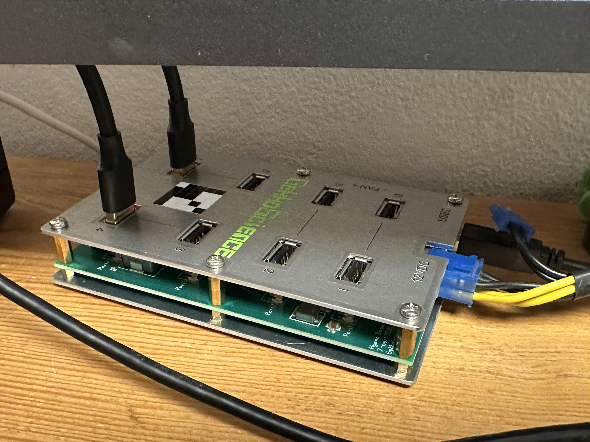
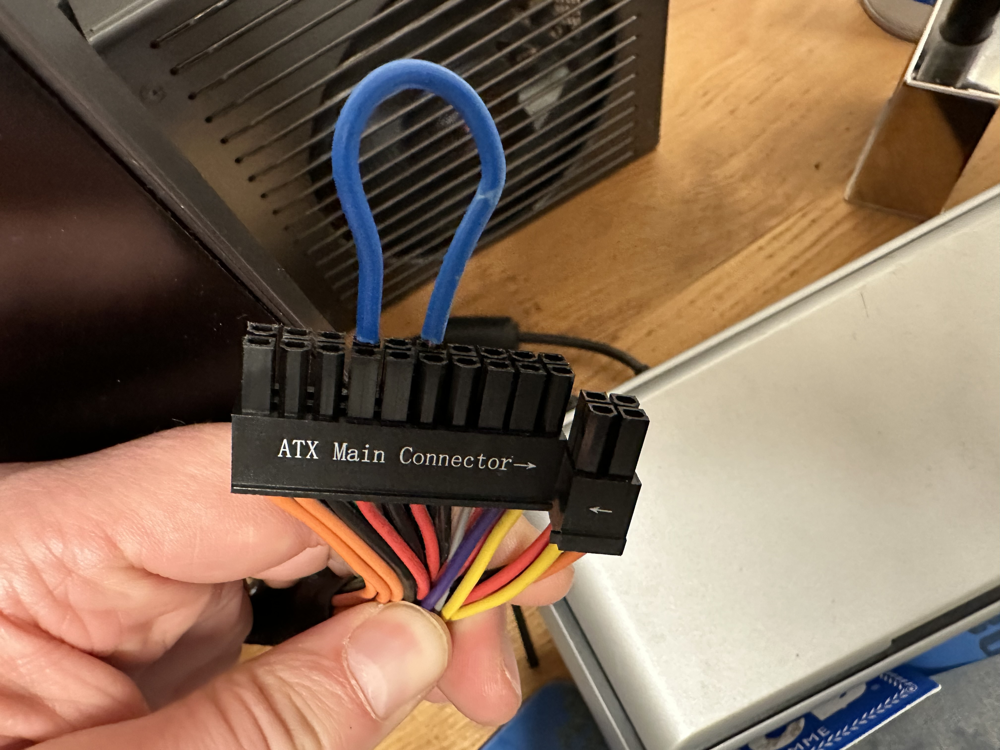
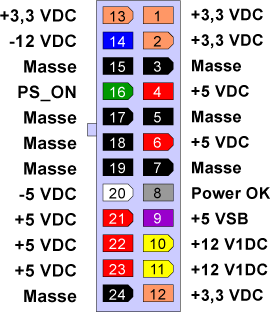

# ☀ Multiple USB-Miner

Mehrere Miner an einem USB-Hub zu betreiben überfordert ALLE Hubs die ich ausprobiert habe, außer der unten genannten Spezialhardware von Gekkoscience. Dies liegt vermutlich daran dass USB gar nicht für Ströme größer 1A spezifiziert ist und sich alle Hubs somit gemäß der Norm verhalten. Das hilft uns natürlich nicht weiter bei einem Stromhungrigen Gerät wie dem Gekkoscience Compac F.

Mit einem Standard-Hub konte ich zwar auch 2 USB-Miner betreiben, jedoch bei mageren 270 MHz (bzw. 150GH/s (ich erinnere mich nicht genau)).

Von daher die dringende Empfehlung zu einem ähnlichen Setup für mehrere USB-Miner:
* Gekkoscience USB-Hub
* Externe ATX-Netzteil (ich verwende ein BeQuiet Straightpower mit 480W)
* USB3-Verlängerungen (auch hier haben nur die USB3-Verlängerungen funktioniert, die eine USB2-Verlängerung die ich verwendete, konnte den Miner nicht in Betrieb nehmen. Der Grund hierfür ist mir unklar.) 

Der Gekkoscience USB-Hub benötigt ein externes Netzteil, welches im Original gekauft werden kann, der Hub bietet aber auch einen Anschluß für einen PCIe-6-Stecker wie er bei jedem ATX-Netzteil vorkommt.

Das Netzteil funktioniert nur wenn der Mainborad-Connector überbrückt wird, sonst läuft das Netzteil nicht an.

Dazu reicht es in meinme Fall Pin 16 (PS_ON) und 18 (Masse) zu überbrücken:

Standard-Pin-Belegung eines 24poligen ATX-Steckers:

---

Alternativ kann man auch einen Schalter für den 20- bzw. 24-poligen Anschluss bestellen:

---

#### [⛏ Miner Einstellungen MHz/ mV](miner-settings.md)  ᐊ  previous | next  ᐅ  [🌩 Übertakten](/uebertakten.md)
